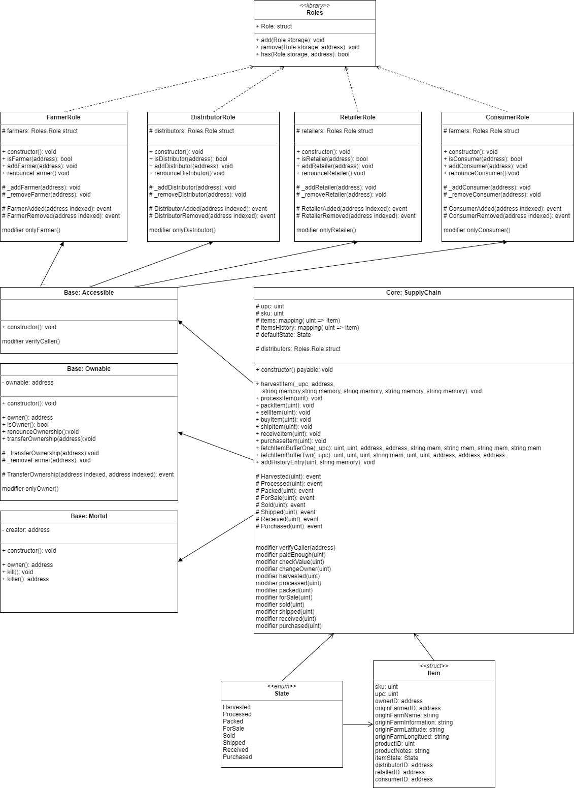
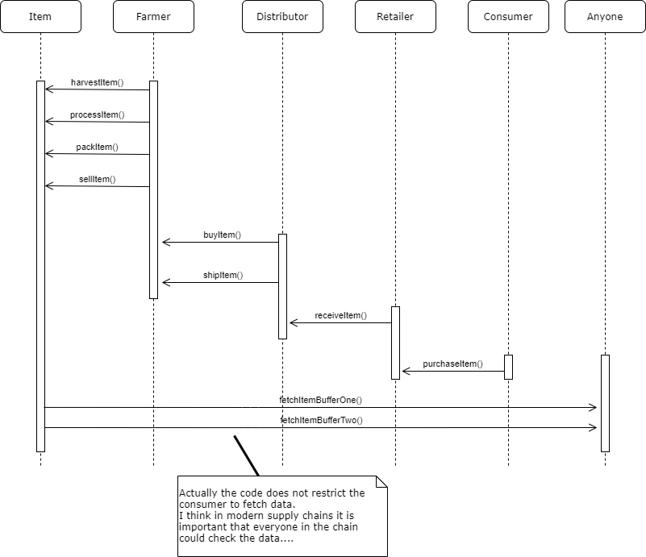

# Supply Chain Project: Magic Mushroom

## Summary
Contract address: **0x1F2E4A2F1412763796458317C829beC3111cE015**
Transaction ID: **0xebe574e1f0a9a8e06702684f4b093b8a0d0f227678527f2ccebf3142fc7a08e2**

## Remarks:
- IPFS was not integrated
- UI has not been changed but all fixes so that the application properly runs.
  It was unclear due to Rubric (https://review.udacity.com/#!/rubrics/1710/view) what to do.
  Full process from harvest to purchase ran successful. 
  
  IPFS was not used. I see that you also wanted to implement this and you can look here for a baseline implementation. It uses the ipfs-api package which is now renamed to ipfs-http-client to interact with the dapp.
  https://github.com/Dev-rick/Simple-Supply-Chain-Udacity
  https://www.npmjs.com/package/ipfs-http-client

## Get Started

1. ``cd project-6``
2. ``truffle compile`` or ``truffle test``
3. ```npm run dev```
4. Experiment in the UI 

#### Setup Truffle Config

``truffle migrate --reset --network rinkeby``
### Configurations
#### Metamask
* Local / Ganache
* Testnet Rinkeby

#### Truffle config
1. Ensure truffle-hdwallet-provider npm package installed and configured in truffle config
````
const HDWalletProvider = require('truffle-hdwallet-provider'),
    mnemonic = "SUPER SECRET ADD",
    infuraRinkeby = "https://rinkeby.infura.io/v3/supersecret";
````
2. Add blockchain networks
````
networks: {
    // for ganache UI / cli = port: 8545
    development: {
      host: "127.0.0.1",     // Localhost (default: none)
      port: 7545,            // Standard Ethereum port (default: none)
      network_id: "*",       // Any network (default: none)
    },
    // test net
    rinkeby: {
      provider: () => new HDWalletProvider(mnemonic, infuraRinkeby),
      network_id: 4,       // Rinkeby's id
      gas: 5500000,        // Rinkeby has a lower block limit than mainnet
      //confirmations: 2,    // # of confs to wait between deployments. (default: 0)
      //timeoutBlocks: 200,  // # of blocks before a deployment times out  (minimum/default: 50)
      //skipDryRun: true     // Skip dry run before migrations? (default: false for public nets )
    },
}
````
## Description

## Design & UML
### Data/Class/Contract Diagram


### Activity Diagram


### Sequence Diagram


### State Diagram


## Libraries Usage:
- For smart contracts:
  - provided library Roles.sol is used
  Recommendations: Ownable, security, secondary, roles, standard patterns for state changes etc. might be used via OpenZeppelin

- Frontend/Backend
  ````
    "devDependencies": {
      "lite-server": "2.4.0" => for building frontend code
    },
    "dependencies": {
      "truffle-hdwallet-provider": "^1.0.17" => Truffle/Infura wallet provider for testnet/prodnet
    }
  ````
## IPFS usage
I really wanted to but see additional remarks.

## Additional remarks:
- Roles: Only oneself can remove a role, only so. with a specific role can add the same role to a new abitrary address.
- I am still unhappy about the old code, but what is even more frustrating is 
  Documentation is not good, outdated, ambiguous + the rubric does not match.
  Actually such behavior leads to the fact, that I am only partially motivated to do optional parts or further experiments and add-ons.
  I would rather invest time to the later instead of investing time in order to understand what to do and to adjust code, fix bugs etc.
- Descriptions of projects are soso for example in requirement 1 you mentioned part A. I have no clue what part A means.
- State diagram vs UML State Diagram => I really like the diagram style, though  it is not UML standard
- Class diagram I tried to utilize UML to improve the diagram (e.g. added library etc.)
- Architecture vs. Code => What we actually do is reverseEngineering the diagram, which is nice, but not real planning.
- Contract inheritance => Core => Base => AccessControl.


## Help due to lack of documentation
- https://andresaaap.medium.com/architect-a-blockchain-supply-chain-solution-part-b-project-faq-udacity-blockchain-da86496fce55
- UI
  - Missing web3 lib: https://knowledge.udacity.com/questions/680976
  - Correct acountId - https://knowledge.udacity.com/questions/680252
- https://docs.openzeppelin.com/contracts/4.x/access-control
- Secondary https://forum.openzeppelin.com/t/proper-design-pattern-for-ownable-contract-with-initializer-and-several-secondary-contracts/1716
- https://www.youtube.com/watch?v=Tnyrp_W5wdM&ab_channel=EatTheBlocks
- Rich spec for eth smart contract verification https://arxiv.org/pdf/2104.10274.pdf
- Diagrams https://knowledge.udacity.com/questions/605356
- https://consensys.net/blog/developers/solidity-best-practices-for-smart-contract-security/
- https://www.linkedin.com/pulse/ethereum-solidity-smart-contract-design-patterns-wael-yousfi/
- https://fravoll.github.io/solidity-patterns/
- Test for events in truffle https://gist.github.com/sogoiii/3ff1bdcd0811dfa7ac99ee6cca53e2c9


## Output Deployment to testnet: Rinkeby
````
E:\E\Education\blockchain\dev\repos\blockchain\part3\nd1309-Project-6b-Example-Template-master\project-6>truffle migrate --reset --network rinkeby

Compiling your contracts...
===========================
> Compiling .\contracts\Migrations.sol
> Compiling .\contracts\coffeeaccesscontrol\ConsumerRole.sol
> Compiling .\contracts\coffeeaccesscontrol\ConsumerRole.sol
> Compiling .\contracts\coffeeaccesscontrol\DistributorRole.sol
> Compiling .\contracts\coffeeaccesscontrol\DistributorRole.sol
> Compiling .\contracts\coffeeaccesscontrol\FarmerRole.sol
> Compiling .\contracts\coffeeaccesscontrol\FarmerRole.sol
> Compiling .\contracts\coffeeaccesscontrol\RetailerRole.sol
> Compiling .\contracts\coffeeaccesscontrol\RetailerRole.sol
> Compiling .\contracts\coffeeaccesscontrol\Roles.sol
> Compiling .\contracts\coffeebase\Accessible.sol
> Compiling .\contracts\coffeebase\Accessible.sol
> Compiling .\contracts\coffeebase\Mortal.sol
> Compiling .\contracts\coffeebase\Ownable.sol
> Compiling .\contracts\coffeecore\SupplyChain.sol
> Compiling .\contracts\coffeecore\SupplyChain.sol
> Artifacts written to E:\E\Education\blockchain\dev\repos\blockchain\part3\nd1309-Project-6b-Example-Template-master\project-6\build\contracts
> Compiled successfully using:
   - solc: 0.8.0+commit.c7dfd78e.Emscripten.clang


Migrations dry-run (simulation)
===============================
> Network name:    'rinkeby-fork'
> Network id:      4
> Block gas limit: 29999886 (0x1c9c30e)


1_initial_migration.js
======================

   Deploying 'Migrations'
   ----------------------
   > block number:        9307108
   > block timestamp:     1631862010
   > account:             0x0b942ab0761F6AAbEd2de1d6fe64138942b6904A
   > balance:             0.991533143930531301
   > gas used:            255388 (0x3e59c)
   > gas price:           2 gwei
   > value sent:          0 ETH
   > total cost:          0.000510776 ETH

   -------------------------------------
   > Total cost:         0.000510776 ETH


2_deploy_contracts.js
=====================

   Deploying 'FarmerRole'
   ----------------------
   > block number:        9307110
   > block timestamp:     1631862019
   > account:             0x0b942ab0761F6AAbEd2de1d6fe64138942b6904A
   > balance:             0.990779545930531301
   > gas used:            349261 (0x5544d)
   > gas price:           2 gwei
   > value sent:          0 ETH
   > total cost:          0.000698522 ETH


   Deploying 'DistributorRole'
   ---------------------------
   > block number:        9307111
   > block timestamp:     1631862026
   > account:             0x0b942ab0761F6AAbEd2de1d6fe64138942b6904A
   > balance:             0.990080879930531301
   > gas used:            349333 (0x55495)
   > gas price:           2 gwei
   > value sent:          0 ETH
   > total cost:          0.000698666 ETH


   Deploying 'RetailerRole'
   ------------------------
   > block number:        9307112
   > block timestamp:     1631862033
   > account:             0x0b942ab0761F6AAbEd2de1d6fe64138942b6904A
   > balance:             0.989382213930531301
   > gas used:            349333 (0x55495)
   > gas price:           2 gwei
   > value sent:          0 ETH
   > total cost:          0.000698666 ETH


   Deploying 'ConsumerRole'
   ------------------------
   > block number:        9307113
   > block timestamp:     1631862039
   > account:             0x0b942ab0761F6AAbEd2de1d6fe64138942b6904A
   > balance:             0.988683643930531301
   > gas used:            349285 (0x55465)
   > gas price:           2 gwei
   > value sent:          0 ETH
   > total cost:          0.00069857 ETH


   Deploying 'Accessible'
   ----------------------
   > block number:        9307114
   > block timestamp:     1631862054
   > account:             0x0b942ab0761F6AAbEd2de1d6fe64138942b6904A
   > balance:             0.987247935930531301
   > gas used:            717854 (0xaf41e)
   > gas price:           2 gwei
   > value sent:          0 ETH
   > total cost:          0.001435708 ETH


   Deploying 'Mortal'
   ------------------
   > block number:        9307115
   > block timestamp:     1631862065
   > account:             0x0b942ab0761F6AAbEd2de1d6fe64138942b6904A
   > balance:             0.986939781930531301
   > gas used:            154077 (0x259dd)
   > gas price:           2 gwei
   > value sent:          0 ETH
   > total cost:          0.000308154 ETH


   Deploying 'Ownable'
   -------------------
   > block number:        9307116
   > block timestamp:     1631862071
   > account:             0x0b942ab0761F6AAbEd2de1d6fe64138942b6904A
   > balance:             0.986346979930531301
   > gas used:            296401 (0x485d1)
   > gas price:           2 gwei
   > value sent:          0 ETH
   > total cost:          0.000592802 ETH


   Deploying 'SupplyChain'
   -----------------------
   > block number:        9307117
   > block timestamp:     1631862093
   > account:             0x0b942ab0761F6AAbEd2de1d6fe64138942b6904A
   > balance:             0.979643203930531301
   > gas used:            3351888 (0x332550)
   > gas price:           2 gwei
   > value sent:          0 ETH
   > total cost:          0.006703776 ETH

   -------------------------------------
   > Total cost:         0.011834864 ETH


Summary
=======
> Total deployments:   9
> Final cost:          0.01234564 ETH


Starting migrations...
======================
> Network name:    'rinkeby'
> Network id:      4
> Block gas limit: 29999972 (0x1c9c364)


1_initial_migration.js
======================

   Deploying 'Migrations'
   ----------------------
   > transaction hash:    0xe0647e47a3d3c4ff044eb2a55f3e4591907babe261705d6fff55d5b1e6b037b8
   > Blocks: 0            Seconds: 12
   > contract address:    0x867A6cb2179496b3441eD4BCc842f8Cbb8e7aBE1
   > block number:        9307114
   > block timestamp:     1631862122
   > account:             0x0b942ab0761F6AAbEd2de1d6fe64138942b6904A
   > balance:             0.991772231925640917
   > gas used:            271688 (0x42548)
   > gas price:           1.000000018 gwei
   > value sent:          0 ETH
   > total cost:          0.000271688004890384 ETH


   > Saving migration to chain.
   > Saving artifacts
   -------------------------------------
   > Total cost:     0.000271688004890384 ETH


2_deploy_contracts.js
=====================

   Deploying 'FarmerRole'
   ----------------------
   > transaction hash:    0x354fe0160f669330f5414638a09dacbd4c6aef6ee418f9423920290c8fb22974
   > Blocks: 1            Seconds: 12
   > contract address:    0xBAA150cDE3c4292747E6e531E65fBE8572e5ea93
   > block number:        9307116
   > block timestamp:     1631862152
   > account:             0x0b942ab0761F6AAbEd2de1d6fe64138942b6904A
   > balance:             0.991361432919022195
   > gas used:            364861 (0x5913d)
   > gas price:           1.000000016 gwei
   > value sent:          0 ETH
   > total cost:          0.000364861005837776 ETH


   Deploying 'DistributorRole'
   ---------------------------
   > transaction hash:    0x5b7d089ced80bfc8ce9c103c20914a538c7d94c08d47241f2706469ea468fb4c
   > Blocks: 0            Seconds: 8
   > contract address:    0xA05A9A36908dAc896138F01383235c737eCe0255
   > block number:        9307117
   > block timestamp:     1631862167
   > account:             0x0b942ab0761F6AAbEd2de1d6fe64138942b6904A
   > balance:             0.9909964999135482
   > gas used:            364933 (0x59185)
   > gas price:           1.000000015 gwei
   > value sent:          0 ETH
   > total cost:          0.000364933005473995 ETH


   Deploying 'RetailerRole'
   ------------------------
   > transaction hash:    0xf92eca78902d8bbbb70ea6e0957d034dc7f9bfc43c54c64a51dd2d740ff5a1f0
   > Blocks: 1            Seconds: 12
   > contract address:    0x3E74D0d20C53C4691C276DBE3459bbcF561b0839
   > block number:        9307118
   > block timestamp:     1631862182
   > account:             0x0b942ab0761F6AAbEd2de1d6fe64138942b6904A
   > balance:             0.990631566908439138
   > gas used:            364933 (0x59185)
   > gas price:           1.000000014 gwei
   > value sent:          0 ETH
   > total cost:          0.000364933005109062 ETH


   Deploying 'ConsumerRole'
   ------------------------
   > transaction hash:    0xa3508ba99489806fb297611355ad333e3948499aa4c8305410c37b6b5d3b6155
   > Blocks: 0            Seconds: 8
   > contract address:    0xfa9576A18AeaBaa20a7Bc091CB13479afa2443FB
   > block number:        9307119
   > block timestamp:     1631862197
   > account:             0x0b942ab0761F6AAbEd2de1d6fe64138942b6904A
   > balance:             0.990266681903330748
   > gas used:            364885 (0x59155)
   > gas price:           1.000000014 gwei
   > value sent:          0 ETH
   > total cost:          0.00036488500510839 ETH


   Deploying 'Accessible'
   ----------------------
   > transaction hash:    0xad149aaa7ba5e547b98a249c01e89cc1fb5687cc3b8670082bde26c6c2016b17
   > Blocks: 0            Seconds: 8
   > contract address:    0xd7120c9BF77a065da1cB453d1DacCB3c03B9aee8
   > block number:        9307120
   > block timestamp:     1631862212
   > account:             0x0b942ab0761F6AAbEd2de1d6fe64138942b6904A
   > balance:             0.989486427892407192
   > gas used:            780254 (0xbe7de)
   > gas price:           1.000000014 gwei
   > value sent:          0 ETH
   > total cost:          0.000780254010923556 ETH


   Deploying 'Mortal'
   ------------------
   > transaction hash:    0xe1c45fc54453754cc314cad006140002d450a111528a47040a96efa12f1b0724
   > Blocks: 0            Seconds: 8
   > contract address:    0x8E4148eD402c6Ee7283A5A09A87240A5c67e5839
   > block number:        9307121
   > block timestamp:     1631862227
   > account:             0x0b942ab0761F6AAbEd2de1d6fe64138942b6904A
   > balance:             0.989316050890192291
   > gas used:            170377 (0x29989)
   > gas price:           1.000000013 gwei
   > value sent:          0 ETH
   > total cost:          0.000170377002214901 ETH


   Deploying 'Ownable'
   -------------------
   > transaction hash:    0x7b0d12d100ca000b68bd2dde4599618ad6673f5f7586ea773482fc6ad1594e50
   > Blocks: 0            Seconds: 8
   > contract address:    0x25C5059BD1A64E6aABe250d88757647f64cA1bc8
   > block number:        9307122
   > block timestamp:     1631862242
   > account:             0x0b942ab0761F6AAbEd2de1d6fe64138942b6904A
   > balance:             0.989004049886136278
   > gas used:            312001 (0x4c2c1)
   > gas price:           1.000000013 gwei
   > value sent:          0 ETH
   > total cost:          0.000312001004056013 ETH


   Deploying 'SupplyChain'
   -----------------------
   > transaction hash:    0xebe574e1f0a9a8e06702684f4b093b8a0d0f227678527f2ccebf3142fc7a08e2
   > Blocks: 0            Seconds: 8
   > contract address:    0x1F2E4A2F1412763796458317C829beC3111cE015
   > block number:        9307123
   > block timestamp:     1631862257
   > account:             0x0b942ab0761F6AAbEd2de1d6fe64138942b6904A
   > balance:             0.985523661840891234
   > gas used:            3480388 (0x351b44)
   > gas price:           1.000000013 gwei
   > value sent:          0 ETH
   > total cost:          0.003480388045245044 ETH


   > Saving migration to chain.
   > Saving artifacts
   -------------------------------------
   > Total cost:     0.006202632083968737 ETH


Summary
=======
> Total deployments:   9
> Final cost:          0.006474320088859121 ETH


